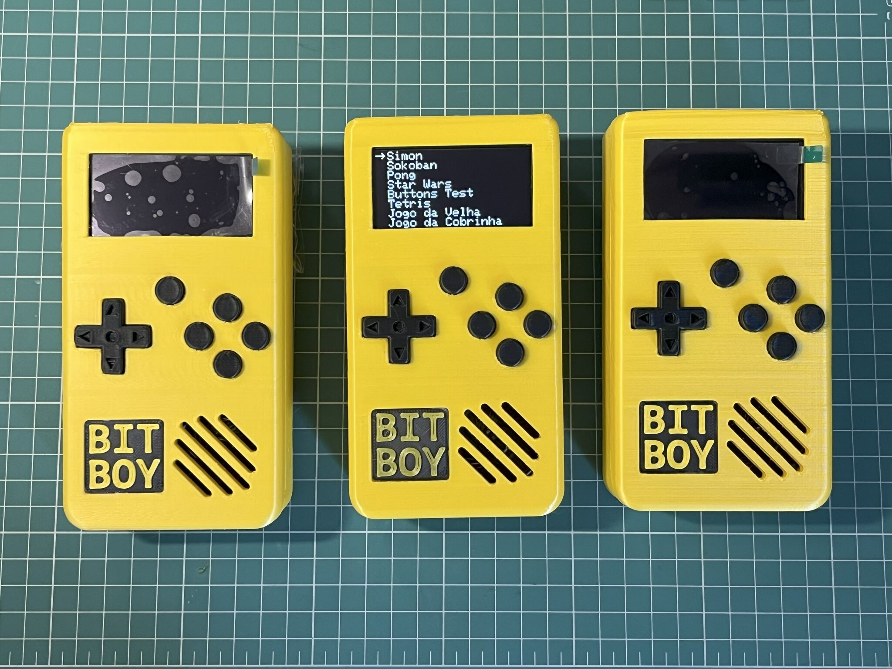

# Bit-Boy

O **Bit-Boy** é um console portátil inspirado no clássico Game Boy, criado como uma plataforma educacional para ensinar **programação** e **eletrônica** de forma prática e divertida.

O console utiliza um **Arduino Nano** como controlador e é totalmente programável em **C/C++**, permitindo que estudantes desenvolvam seus próprios jogos para a **tela OLED 128x64**. Além disso, o Bit-Boy possui:

- Caixa de som integrada
- 11 botões para controle completo
- Carcaça impressa em 3D
- Placa PCB customizada para funcionamento otimizado

O projeto foi pensado para enriquecer aulas, oficinas e projetos de aprendizado prático, aproximando os alunos do mundo da tecnologia de maneira lúdica e motivadora.

---

## Jogos Desenvolvidos 🎮

Confira alguns jogos que já foram implementados no Bit-Boy, com tutoriais disponíveis no YouTube:

### 0. [Apresentação do Bit-Boy](https://youtu.be/Hm215J25mg0)

### 1. [Tutorial do jogo Pong](https://youtu.be/_WeT_a9Bf7M)

### 2. [Tutorial do jogo Sokoban](https://youtu.be/MUklkDglsnI)

### 3. [Tutorial do jogo Simon](https://youtu.be/KW0hAZCAxOg)

---

## Como começar

1. Conecte o **Bit-Boy** ao computador via USB.
2. Abra os exemplos de jogos em **C/C++** no Arduino IDE.
3. Faça upload do código para o console.
4. Experimente, modifique e crie seus próprios jogos!

---

## Contribuindo

Se você quiser desenvolver novos jogos ou tutoriais, contribuições são muito bem-vindas! Abra **pull requests** ou envie sugestões para aprimorar o Bit-Boy.

---

Explore, programe e divirta-se com o **Bit-Boy**! 🚀
